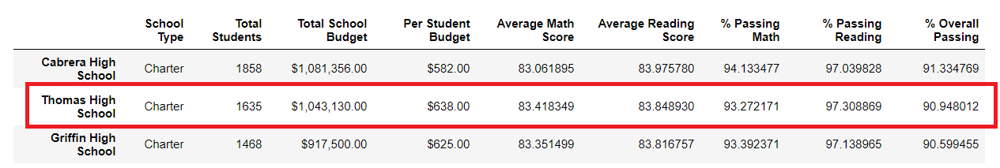
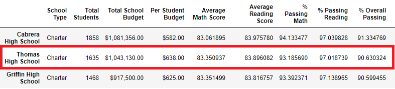

# School District Analysis

## Overview 
The school board notified Maria that there is evidence of academic dishonesty with regards to the ninth grade math and reading scores at Thomas High School. Those scores needed to be excluded, and the school board requested to have the analysis run again. 

To do this, I used PythonData in Jupyter Notebooks. My input files were:

- schools_complete.csv
- students. complete.csv

## Results
First, I excluded the 9th grade scores at Thomas High School by replacing their grades with nulls . To do this, I used the numpy Pandas library. After loading the library, I used loc to find the Thomas High School ninth graders and replace their scores with np.nan. The code was:

```
student_data_df.loc[(student_data_df["school_name"] == "Thomas High School") & (student_data_df["grade"] == "9th"), "reading_score"]=np.nan 
student_data_df.loc[(student_data_df["school_name"] == "Thomas High School") & (student_data_df["grade"] == "9th"), "math_score"]=np.nan 
```
Then I ran through the analysis again.
-  **How the district summary was affected:**
	
	- The passing math percentage went down by .2%.
	- The passing reading percentage went down by .3%.
	- The overall passing percentage went down by .1%.
	
- **How the school summary was affected (Thomas High School):**
  - The passing math percentage went down by .1%.
   -  The passing reading percentage went down by .3%.
   -  The overall percentage went down by .3%.
  
- **How Thomas High School was affected in relation to the other schools:**

Thomas High School was not affected, as the margin was so slight that it stayed the second top school.

  *Before:*

    

  *After:*

    

- **How replacing the ninth grade scores affected the following**:

  - Math and reading scores by grade: 9th graders for Thomas High School were excluded; nothing else was changed.
  - Scores by school spending: There was no change.
  - Scores by school size: There was no change.
  - Scores by school type: There was no change.

## Summary
The major changes to be made in the updated school district analysis are:
- The District Summary went down slightly for passing math, reading, and overall percentages.
- On the School Summary, Thomas High School remained in its position as second top school. However, its statistics  went down slightly for passing math, reading, and overall percentages.


